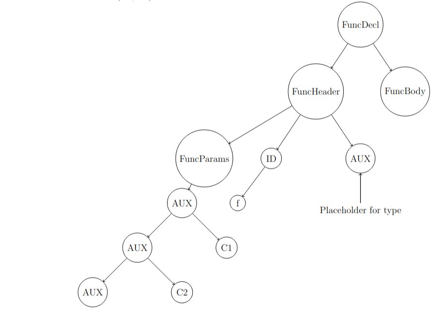
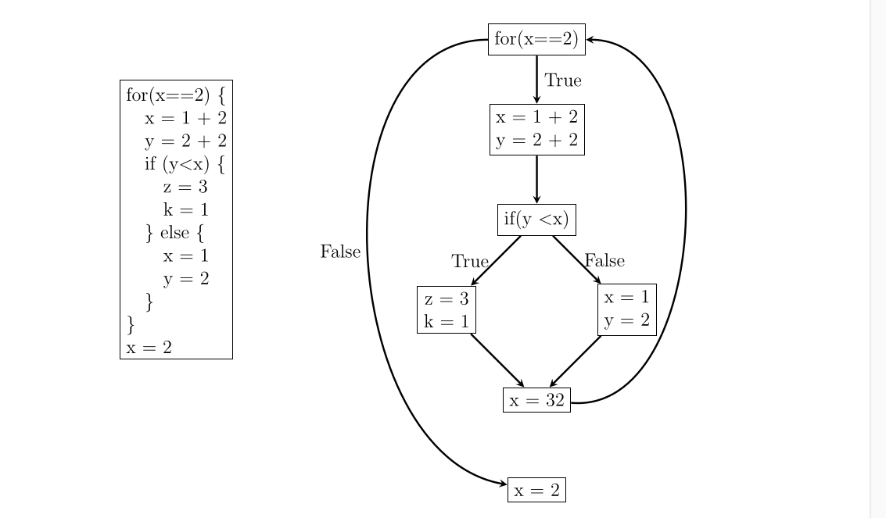

# 

# deiGo Compiler
## Report for Compilers 2024/25 course project

### Authors:
Miguel Castela, uc2022212972  
Nuno Batista, uc2022216127

## Introduction
This report describes the development of a compiler for the deiGo language, carried out as part of the Compilers course project for the academic year 2024/25. The goal of this project is to apply the knowledge acquired through-out the course in the construction of a functional compiler.

## Grammar

### Handling of Optional and Repeated Elements
Optional and repeated elements are handled through specific grammar rules that define alternatives for their presence or absence. By explicitly defining optional elements, we ensure that the parser can correctly handle cases where certain elements are missing. This is essential for maintaining the correctness of the AST later on. By using optional nodes, we can easily append new declarations to the existing list. For
example:

```
VarSpec → IDENTIFIER {COMMA IDENTIFIER} Type
```

translates to rules:

```c
VarSpec : IDENTIFIER StarCommaId Type
```

and:

```c
StarCommaId : StarCommaId COMMA IDENTIFIER
```

This rule, designed to manage repeated identifiers separated by commas, is particularly useful for handling multiple variable declarations in a single statement. For this, the rule employs recursion, where each node represents a variable declaration.

### Optimization and Readability
We define operator precedence and associativity explicitly to resolve ambiguities. This ensures that expressioons are parsed correctly according to the deiGo language specifications.
Examples of the transcription of the initnal grammar in EBNF notation to the Yacc format:

```
Declarations → {VarDeclaration SEMICOLON | FuncDeclaration SEMICOLON}
```

```c
Declarations : Declarations FuncDecl SEMICOLON
```

```
VarSpec → IDENTIFIER {COMMA IDENTIFIER} Type
```

```c
VarSpec : IDENTIFIER StarCommaId Type
```

```
FuncDeclaration → FUNC IDENTIFIER LPAR [Parameters] RPAR [Type] FuncBody
```

```c
FuncDecl : FUNC IDENTIFIER LPAR OptFuncParams RPAR OptType FuncBody
```

### Syntax Error Handling
To recover from local syntax errors we added some special rules in order to keep parsing and detect the maximum ammout of errors:

```c
FuncInvocation : IDENTIFIER LPAR PosExpr RPAR
               | IDENTIFIER LPAR error RPAR
{
    yyerror("Error in function invocation, skipping to next statement.");
    $$ = new_node(AUX, NULL);
}
;
```

For example, in this rule, the `FuncInvocation` non-terminal includes an alternative that handles errors within function invocations.

## AST/Symbol Table Algorithms and Data Structures

### Auxiliary AST Nodes
In our grammar, we use auxiliary (AUX) nodes to store the children of nodes with an undefined number of children. This approach helps in managing optional and repeated elements by acting as a container 3 for multiple instances of a particular non-terminal. This function has the main goal of maintaining a clear and organized AST. By grouping related nodes under an Aux node we can ensure that the tree structure is easy to traverse and understand. As this is a temporary container, at the end of the syntax analysis, we perform a DFS traversal to append the AUX nodes' children to their respective parent nodes, using the `remove_aux` function.
For example, this would be an AST substructure when parsing the function f(C1, C2):



### LOCATE
This macro serves as a way to store the lines and columns of a specific node. In this way we can identify the nodes that are responsible for creating semantic errors.

### AST Structs

#### Node Struct

```c
struct node {
    enum category category;  
    char *token;
    int token_line, token_column; 
    enum type type;
    char *parameter_list;
    struct node_list *children;
};
```

| Member          | Description                                                                 |
|-----------------|-----------------------------------------------------------------------------|
| category        | An enum representing the category of  the node.                              |
| token           | A string representing the lexical token associated with the node.           |
| token_line      | Integers storing the line and column numbers of the token, useful for error reporting. |
| token_column    | Integers storing the line and column numbers of the token, useful for error reporting. |
| type            | An enum representing the type of the node.                                  |
| parameter_list  | A string representing the list of parameters for function nodes.            |
| children        | A pointer to a `node_list` struct, representing the children of this node.  |

### Symbol Table Structs

#### Symbol List

```c
struct symbol_list {
    char *identifier;
    enum type type;
    struct node *node;
    int is_parameter;
    struct symbol_list *next;
    int was_used;
    int is_function;
    char *function_parameters;
};
```

| Member              | Description                                                                 |
|---------------------|-----------------------------------------------------------------------------|
| identifier          | A string representing the name of the symbol.                               |
| type                | An enum representing the type of the symbol.                                |
| node                | A pointer to the AST node associated with the symbol.                       |
| is_parameter        | An integer indicating if the symbol is a function parameter.                |
| next                | A pointer to the next `symbol_list` element.                                |
| was_used            | Flag activated when a declared variable is used. Indicates whether a "variable not used" error should be thrown at the end of the analysis. |
| is_function         | An integer indicating if the symbol is a function.                          |
| function_parameters | Comma-separated parameters in string format, used to check if a function is being correctly called. |

#### Scopes Queue

```c
struct scopes_queue {
    struct symbol_list *table;
    struct scopes_queue *next;
    struct node *func_body; // The function body node is stored here so it can be processed after the function declarations
    char *identifier;
};        
```

In order to make the functions and global variables available anywhere in the code, we first make a preliminary AST pass where every function header and global variable are added to the global symbol table. During this first descent, the function bodies associated with their respective scopes are added to a queue where they will be processed in FIFO order after the first descent is finished.

## Code Generation

### Basic Blocks



Our control flow graph is structured such that each node is a basic block, which are generated according to the basic block creation algorithm. Moreover, when a return statement is found in the middle of a basic block, code stops being generated as the code that succeeds the return statement is unreachable.

### String Literal Processing
In order to determine the real string literal length, also taking into account the escape sequences, we use the `process_escape_sequences` function. This function goes through the string, counting each character and translating the valid deiGo escape sequences into their respective LLVM IR escape sequence codes.

### Tail Call Optimization
By keeping track of an `is_tail` flag, which is turned on before the last statement of a given function is processed, we know when we should activate the tail flag on the call instruction. When the `is_tail` flag is turned on and the statement has a function call.

### Short Circuit

```c
var x int;
func() {
    x = 1;
    return False
}
main() {
    x = 1; 
    if (True || func())
    //(false && func()) would also display short circuit
    {
        x = 2;
        return False;        
    }
}
```

In the example above, the function call to `func()` is never executed, as the first operand of the OR operator is True. This is an example of short-circuit evaluation, where the second operand is not evaluated if the first operand is sufficient to determine the result of the expression. This optimization can be applied to both logical AND and OR operators, and can help improve the efficiency of the generated code by avoiding unnecessary evaluations.

### Outputs
At the start of the LLVM IR files, some format specifiers are declared for the different variable types:

```c
"@.str_int = private unnamed_addr constant [4 x i8] c\"%%d\\0A\\00\"\n"
"@.str_float = private unnamed_addr constant [7 x i8] c\"%%.08F\\0A\\00\"\n"
"@.str_true = private unnamed_addr constant [6 x i8] c\"true\\0A\\00\"\n"
"@.str_false = private unnamed_addr constant [7 x i8] c\"false\\0A\\00\"\n"
"@.str_string = private unnamed_addr constant [4 x i8] c\"%%s\\0A\\00\"\n"
```

When a print statement is found, the C library's `printf` function is called, and an `i8*` pointer is passed as an argument. This pointer is obtained by passing the printed expression through the previously declared format specifier.

### Main Function and Console Arguments
In order to make the code more organized, the LLVM equivalent of the main function is only generated after all the other functions have been declared. This way, the main function will always be the last in the file. Also, the `codegen_main` is different from the `codegen_function` as the main function has to take into account the console parameters through the variables `i32 argc` and `i8 *argv`. These parameters are translated into integers using the C library function `atoi`.
